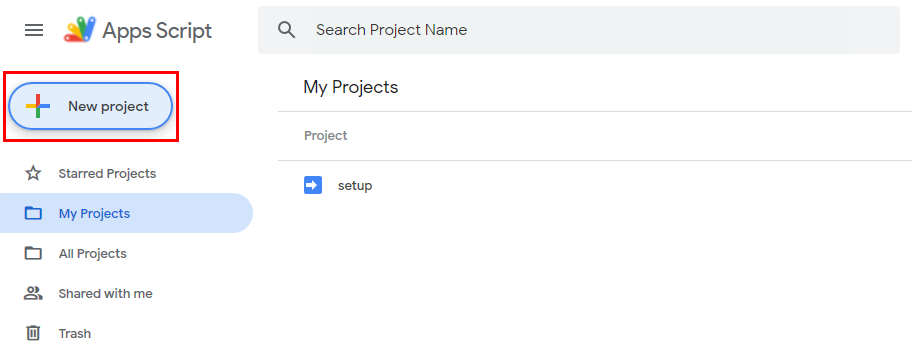

# Google Scripts
Contact: Giancarlo Pernudi Segura (pernudi@ualberta.ca)

# Instructions
## participation_document_duplication.gs
You'll be using using your UAlberta GSuite account for these instructions.
### Setup
You can skip this part if you already have a folder and file you want to duplicate.
1. Go to [Google Drive](https://drive.google.com/drive/).
2. Create a new folder and give it a unique name not used elsewhere.
3. In that folder you've created, create a new document of any type and give it a unique name.
4. Now you can edit that file you've created and populate it with content.
### Run
**Assumption**: You have a folder with a template document created. If not, go to the [previous section](#Setup).
1. Go to https://script.google.com/home and create a new project.

2. You'll notice you get a code editor with some code on it. You can delete this code since we'll be replacing it.

```js
function myFunction() {
  
}
```
3. Open [`participation_document_duplication.gs`](https://raw.githubusercontent.com/cmput229/Google_Scripts/main/participation_document_duplication.gs?token=AHN6LHCFTHZZVJRBQRQFU4LAUK2YI) by clicking on it on GitHub.

4. Copy everything from that file and paste it into the code editor on Google App Script.
5. Fill out the parameters at the top with the values you want. Reference [the parameters table](#Parameters).

6. Once you've filled out the parameters, **save your project** by clicking on the floppy disk icon. Then, select duplicate from the dropdown menu at the top.

7. Now click run. If you're running this script for the first time. Google will open a pop-up asking for permission to your google drive and asking if you trust this script. Accept it.

8. A log at the bottom will open up with progress. If any errors occur, it will notify you via the logs.
9. Once it says *Execution completed*, you can look at your folder with all the new files it has created.
### Parameters
PARAMETER NAME|DESCRIPTION|TYPE|EXAMPLE|
---|---|---|---
FOLDER|The name of the folder you want to use. Must contain the template file you wish to duplicate.|String|`"test folder"`
FILENAME|The name of the template file you wish to duplicate.|String|`"template file"`
GROUPS_N|The number of duplications you want to create.|Number|`15`
OUTPUT_FILENAME|The output name of the duplicated folder. Ouptut will be of format: `Room {x}: {OUTPUT_FILENAME}`.|String|`"Jan 2 Exercise"`
SHARE_WITH|A list of emails you wish to share the folder with. Users will be given Editor access.|[String]|`["pernudi@ualberta.ca", "jamaral@ualberta.ca"]` or `[]` (if don't want to share)
